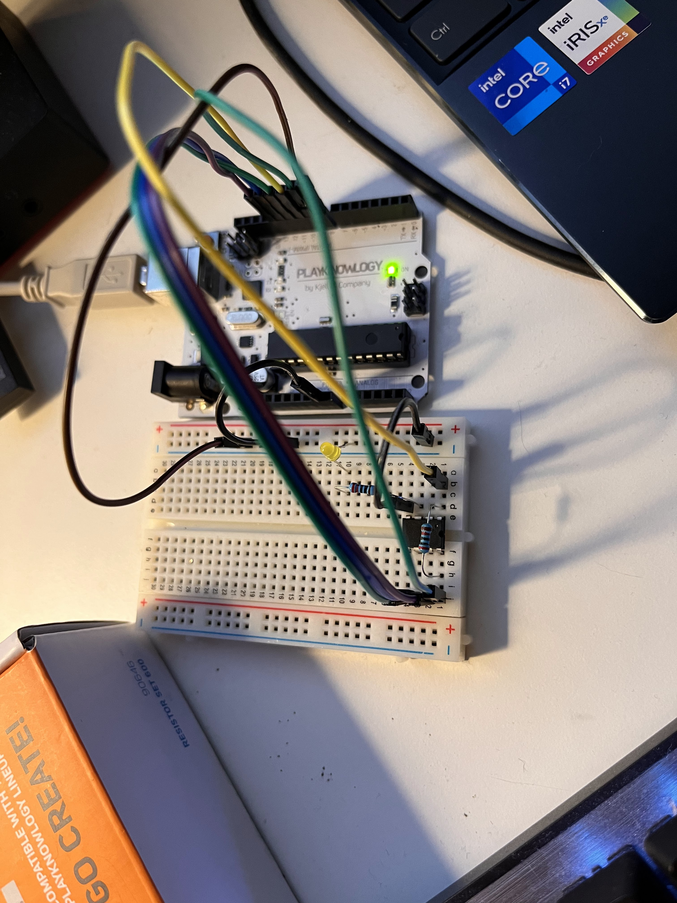

# Debugging the Atmega

## Hardware debugging using debugwire
I removed the debug/programming logic in the software and created a MVP circuit(I think it can be more MVP).

## Resources
* [dwire-debug](https://github.com/dcwbrown/dwire-debug): The source used by Waynes tinkering dude
* [AVR Arduino Hardware debugger on the cheap](https://sites.google.com/site/wayneholder/avrarduino-hardware-debugger-on-the-cheap): Basically all the good stuff is here.